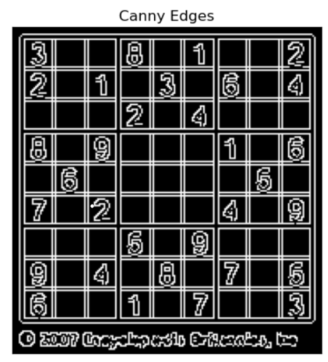

# Edge-Linking-using-Hough-Transform
## Aim:
To write a Python program to detect the lines using Hough Transform.

## Software Required:
Anaconda - Python 3.7

## Algorithm:
### Step1:
Import all the necessary modules for the program.

### Step2:
Load a image using imread() from cv2 module.

### Step3:
Convert the image to grayscale.

### Step4:
Using Canny operator from cv2,detect the edges of the image.

### Step5:
Using the HoughLinesP(),detect line co-ordinates for every points in the images.

### Step 6
Using For loop,draw the lines on the found co-ordinates.

### Step 7
Display the image.

## Program:
```py
import cv2
import numpy as np
import matplotlib.pyplot as plt
```

# Read image and convert it to grayscale image
```py
pic=cv2.imread('img.png')
cv2.imshow('Original',pic)

togray = cv2.cvtColor(pic,cv2.COLOR_BGR2GRAY)
cv2.imshow('BGR To HSV',togray)

img=cv2.GaussianBlur(togray,(3,3),0)
cv2.imshow('Gaussian Blur',img)

cv2.waitKey(0)
cv2.destroyAllWindows()
```
# Find the edges in the image using canny detector and display
```py
canny_edges=cv2.Canny(img,250,100)
plt.figure(1)
plt.imshow(canny_edges,cmap='gray')
plt.title('Canny Edges'),plt.xticks([]),plt.yticks([])
plt.show()
```
# Detect points that form a line using HoughLinesP
```py
lines=cv2.HoughLinesP(canny_edges,1,np.pi/180,threshold=50,minLineLength=100,maxLineGap=100)
```
# Draw lines on the image
```py
for line in lines:
    x1,y1,x2,y2=line[0]
    cv2.line(pic,(x1,y1),(x2,y2),(0,0,225),1)
```
# Display the result
```py
plt.figure(1)
plt.imshow(pic)
plt.title('Lines'),plt.xticks([]),plt.yticks([])
plt.show()
```
## Output

### Input image and grayscale image


### Canny Edge detector output


### Display the result of Hough transform


## Result:
Thus the program is written with python and OpenCV to detect lines using Hough transform. 
